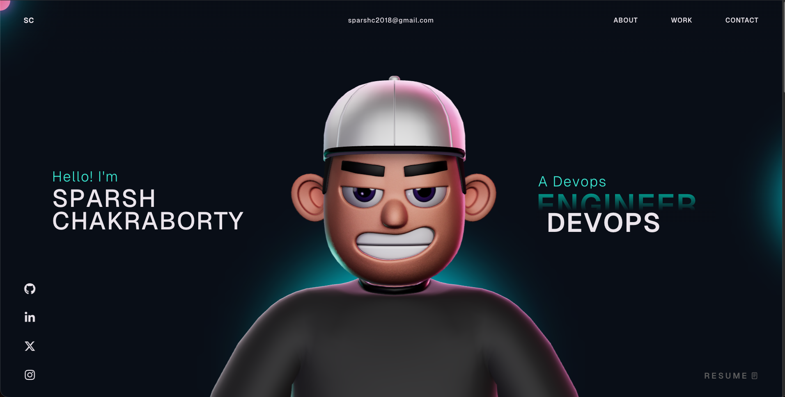

# 🚀 Sparsh Chakraborty - DevOps Portfolio



This is my personal portfolio showcasing my experience as a DevOps Engineer, focusing on cloud infrastructure, automation, and scalable system design.

---

## 🧑‍💻 About Me

Enterprise Sr System Associate / DevOps Engineer with 6+ years of experience in cloud, infrastructure automation, and production support. Passionate about building scalable, reliable, and efficient systems using modern DevOps practices.

---

## ⚙️ Tech Stack

### ☁️ Cloud

* AWS (EC2, S3, Lambda, DynamoDB, VPC, IAM)

### 🏗️ Infrastructure as Code

* Terraform
* CloudFormation

### 🔁 CI/CD & Version Control

* Jenkins
* Git

### 📦 Containers & Orchestration

* Docker
* Kubernetes

### 📊 Monitoring & Observability

* Prometheus
* Grafana

### 💻 Scripting

* Python
* Bash

### ⚙️ Configuration Management

* Ansible

---

## 📌 Features

* Interactive 3D Tech Stack visualization using Three.js
* Fully responsive modern UI
* Optimized performance with WebP assets
* Clean and minimal design
* Deployed on Vercel with CI/CD integration

---

## 🚀 Getting Started

### Clone the repo

```bash
git clone https://github.com/your-username/your-repo.git
cd your-repo
```

### Install dependencies

```bash
npm install
```

### Run locally

```bash
npm run dev
```

---

## 📦 Deployment

This project is deployed using **Vercel** with automatic deployments on every push.

---

## 📬 Contact

📧 [sparshc2018@gmail.com](mailto:sparshc2018@gmail.com)
📍 Bangalore, India

---

## ⭐ If you like this project

Give it a star ⭐ on GitHub!
